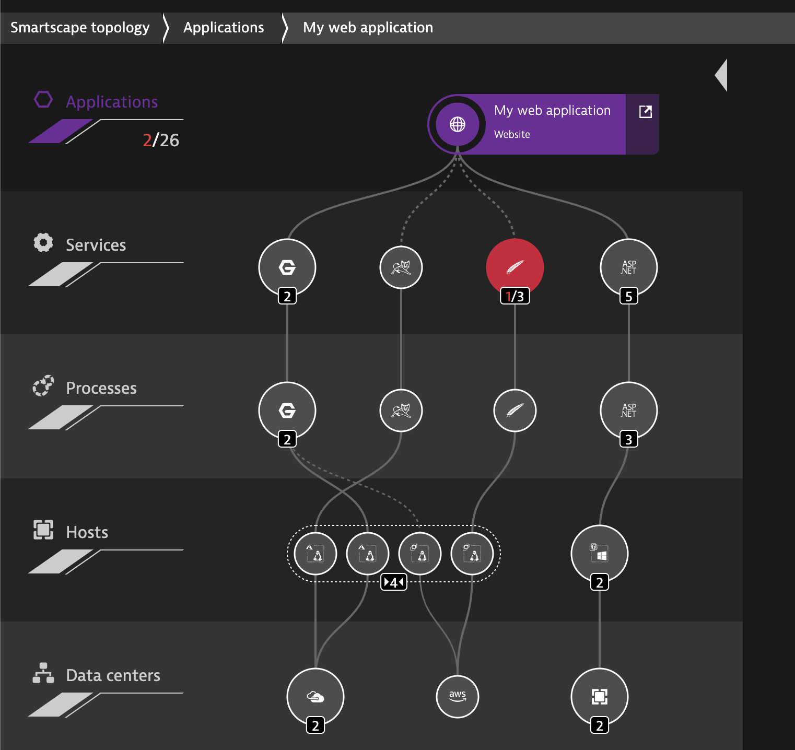

id: dt-codelab-template
summary: Dynatrace Codelab Template
author: Kyle Harrington
last update: 2/2/22

# How to Write a DT Codelab
<!-- ------------------------ -->
## Overview 
Duration: 5

### What You’ll Learn Today 
Provide a executive summary of the topic we're going to cover 
- what is it?
- why is it important?
- how is this going to benefit the audience?
- What problem are we solving?
- what will they learn? 

Lorem ipsum dolor sit amet, consectetur adipiscing elit, sed do eiusmod tempor incididunt ut labore et dolore magna aliqua. Ut enim ad minim veniam, quis nostrud exercitation ullamco laboris nisi ut aliquip ex ea commodo consequat. Duis aute irure dolor in reprehenderit in voluptate velit esse cillum dolore eu fugiat nulla pariatur. Excepteur sint occaecat cupidatat non proident, sunt in culpa qui officia deserunt mollit anim id est laborum.

<!-- -------------------------->
## Technical Specification 
Duration: 2

### 
Detail the technical requirements 
- Technologies in use
- Relevant architecture/ network / traffic flow diagram
- prerequisites for setup
- VM specficication/ container/  host sizing, 
- cli binaries / git repos/ other software needed 




Lorem ipsum dolor sit amet, consectetur adipiscing elit, sed do eiusmod tempor incididunt ut labore et dolore magna aliqua. Ut enim ad minim veniam, quis nostrud exercitation ullamco laboris nisi ut aliquip ex ea commodo consequat. Duis aute irure dolor in reprehenderit in voluptate velit esse cillum dolore eu fugiat nulla pariatur. Excepteur sint occaecat cupidatat non proident, sunt in culpa qui officia deserunt mollit anim id est laborum.


<!-- -------------------------->
## Setup
Duration: 15

Detail the technical requirements 
- Technologies in use
- Relevant architecture/ network / traffic flow diagram
- prerequisites for setup
- VM specficication/ container/  host sizing, 
- cli binaries / git repos/ other software needed 

Lorem ipsum dolor sit amet, consectetur adipiscing elit, sed do eiusmod tempor incididunt ut labore et dolore magna aliqua. Ut enim ad minim veniam, quis nostrud exercitation ullamco laboris nisi ut aliquip ex ea commodo consequat. Duis aute irure dolor in reprehenderit in voluptate velit esse cillum dolore eu fugiat nulla pariatur. Excepteur sint occaecat cupidatat non proident, sunt in culpa qui officia deserunt mollit anim id est laborum.

<!-- ------------------------ -->
## Code Snippets
Duration: 3

To include code snippets you can do a few things.
- Inline highlighting can be done using the tiny tick mark on your keyboard: "`"
- Embedded code

### JavaScript

```javascript
{
  key1: "string",
  key2: integer,
  key3: "string"
}
```

### Java

```java
for (statement 1; statement 2; statement 3) {
  // code block to be executed
}
```

<!-- ------------------------ -->
## Hyperlinking and Embedded Images
Duration: 1
### Hyperlinking
[FREE- Dynatrace SaaS Trial](https://www.dynatrace.com/trial/)

### Images

- You can add images to your git repository

<!-- ------------------------ -->
## Other Stuff
Duration: 1

Checkout the official documentation here: [Codelab Formatting Guide](https://github.com/googlecodelabs/tools/blob/master/FORMAT-GUIDE.md)
