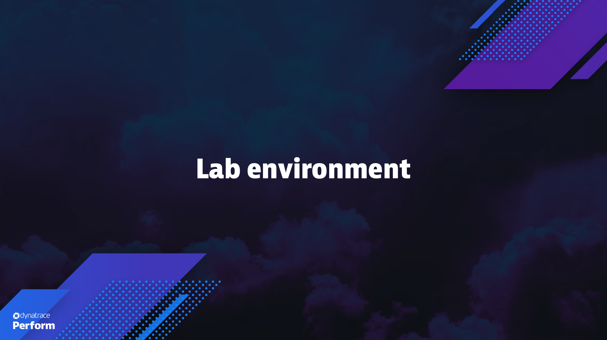
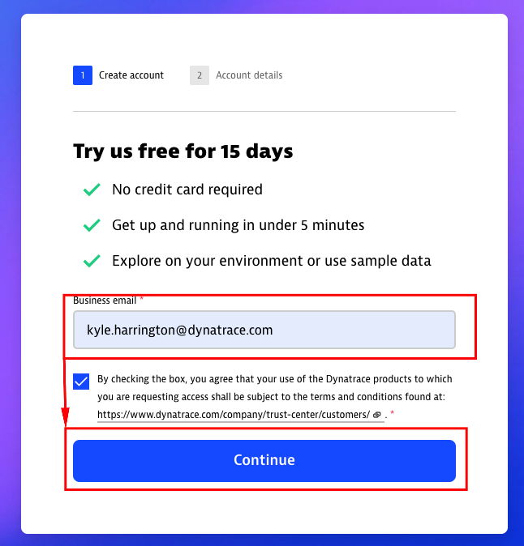
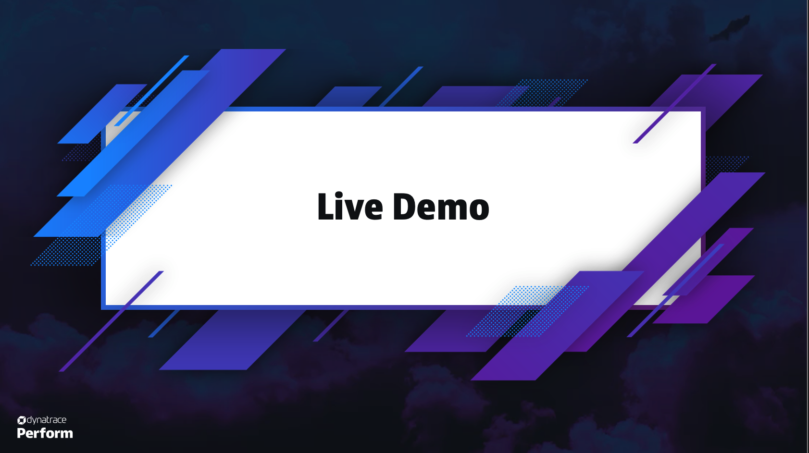

id: dt-workshop-template
summary: Dynatrace SE Workshop Template
author: Kyle Harrington
last update: 6/14/2024

# DT Workshop & Code Lab Template
<!-- ------------------------ -->
## Overview 
Duration: 5

### What You’ll Learn Today
Provide a executive summary of the topic we're going to cover 
- what is it?
- why is it important?
- who is the target audience/ persona
- how does this benefit the audience/ persona?
- What problem are we solving?
- What is the value of this 
- what will the audidence actually learn?


Lorem ipsum dolor sit amet, consectetur adipiscing elit, sed do eiusmod tempor incididunt ut labore et dolore magna aliqua. Ut enim ad minim veniam, quis nostrud exercitation ullamco laboris nisi ut aliquip ex ea commodo consequat. Duis aute irure dolor in reprehenderit in voluptate velit esse cillum dolore eu fugiat nulla pariatur. Excepteur sint occaecat cupidatat non proident, sunt in culpa qui officia deserunt mollit anim id est laborum.

<!-- -------------------------->
## Technical Specification 
Duration: 5

### Detail the technical requirements 
- Technologies in use
  - Versioning if relevant  
- Relevant architecture/ network / traffic flow diagram
- Prerequisites for setup
  - VM specification/ container/  host sizing, 
  - cli binaries / git repos/ other software needed





Lorem ipsum dolor sit amet, consectetur adipiscing elit, sed do eiusmod tempor incididunt ut labore et dolore magna aliqua. Ut enim ad minim veniam, quis nostrud exercitation ullamco laboris nisi ut aliquip ex ea commodo consequat. Duis aute irure dolor in reprehenderit in voluptate velit esse cillum dolore eu fugiat nulla pariatur. Excepteur sint occaecat cupidatat non proident, sunt in culpa qui officia deserunt mollit anim id est laborum.


<!-- -------------------------->
## Setup
Duration: 15

### How to install or configure the workshop content
1. Provide
1. The 
1. Steps
1. To
1. Do
1. The 
1. Thing


`Include direct images for where to to "click"`



#### copy paste commands are recommend: 
$ make me a sammich

vs 

> $ sudo make me a sammich

or 

```
$ sudo make me a sammich
```

Inline code formatting references: 

```javascript
var s = "JavaScript syntax highlighting";
alert(s);
```
 
```python
s = "Python syntax highlighting"
print s
```

```bash
s = "bash syntax highlighting"
print $s
```

Lorem ipsum dolor sit amet, consectetur adipiscing elit, sed do eiusmod tempor incididunt ut labore et dolore magna aliqua. Ut enim ad minim veniam, quis nostrud exercitation ullamco laboris nisi ut aliquip ex ea commodo consequat. Duis aute irure dolor in reprehenderit in voluptate velit esse cillum dolore eu fugiat nulla pariatur. Excepteur sint occaecat cupidatat non proident, sunt in culpa qui officia deserunt mollit anim id est laborum.

<!-- ------------------------ -->
## Demo The New Functionality
Duration: 30

### Make the sausage
- execute the demo on how to solve the problem statement you posed
- This might just be more steps (?)
- This might just be a power point presentation



Lorem ipsum dolor sit amet, consectetur adipiscing elit, sed do eiusmod tempor incididunt ut labore et dolore magna aliqua. Ut enim ad minim veniam, quis nostrud exercitation ullamco laboris nisi ut aliquip ex ea commodo consequat. Duis aute irure dolor in reprehenderit in voluptate velit esse cillum dolore eu fugiat nulla pariatur. Excepteur sint occaecat cupidatat non proident, sunt in culpa qui officia deserunt mollit anim id est laborum.


<!-- -------------------------->
## Wrap Up
Duration: 5
### What You Learned Today 
Review all the points you made at the start:
- What did the audience just learn?
- Why is this gained knowledge important?
- How will this knowledge now benefit the audience/ persona?
- What problem have we solved?
- Q&A 

<!-- ------------------------ -->
### Supplemental Material
Duration: 1

- Include all refence documentation links here
  - Any links included in the code lab should be here
  - Relevant links not explicitcly called out about (like code lab formatting beow)

- [Markdown Formatting Refernce](https://github.com/adam-p/markdown-here/wiki/Markdown-Cheatsheet)
- [Codelab Formatting Guide](https://github.com/googlecodelabs/tools/blob/master/FORMAT-GUIDE.md)

`have a great time`

