id: dt-kubernetes-setup
summary: Dynatrace K8s Operator Install & Walk Through
author: Kyle Harrington
last update: 2/7/22

# Dynatrace K8s Operator Install & Walk Through
<!-- ------------------------ -->
## Overview 
Duration: 5

### What You’ll Learn Today 
Today we will cover the installation and value provided by the [Dynatrace Kubernetes Operator deployment](https://github.com/Dynatrace/dynatrace-operator)

The Dynatrace operator is the k8s native way to gain full stack observability in your kubernetes and open shift environments. The Dynatrace operator provides continuous, automatic discovery & observability across your kubernetes workloads. Leveraging Dynatrace, organizations can start Day 2 operations Day 1 and inform their shift left initiatives. 


### In today's lab we will:

1. Stand up an new kubernetes cluster
1. Deploy the Dynatrace Operator
1. Deploy a Microservice sample application
1. Configure Real User Monitoring for our sample application
1. Set up synthetic checks 
1. Review the full stack data collected by Dynatrace


<!-- -------------------------->
## Technical Specification 
Duration: 5

### Technologies We Will Work With Today
- Dynatrace SasS Tenant: https://www.dynatrace.com/trial/
- kubectl cli:  https://kubernetes.io/docs/tasks/tools/install-kubectl-linux/
- Kubernetes: https://kubernetes.io/
- Google Kubernetes Engine: https://cloud.google.com
- Google Microservices Demo: https://github.com/GoogleCloudPlatform/microservices-demo
- Dynatrace Operator: https://github.com/Dynatrace/dynatrace-operator

### Dynatrace Operator Functionality Visualized: 

The Dynatrace Operator deploys and maintains a DaemonSet across all workers nodes of your Kubernetes cluster. The Dynatrace Operator integrates with the Kubernetes API to provide native k8s events, monitors the cluster node health and provides code level visibility into all pods across all nodes _automatically_.
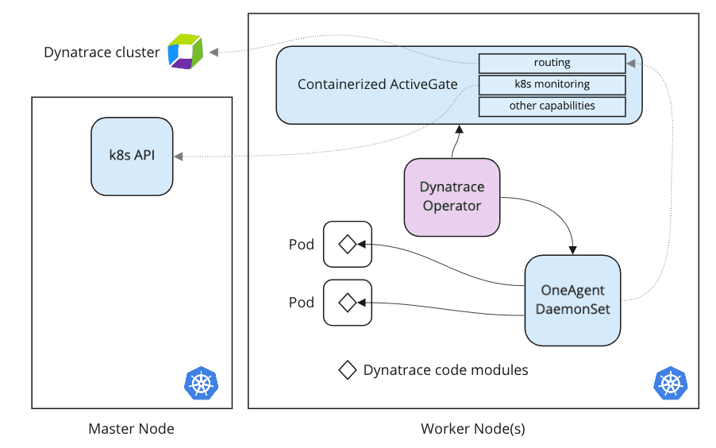

<!-- -------------------------->
## SETUP: Create a Google Kubernetes Engine Cluster
Duration: 5

### Spin up a cluster in Google Kubernetes Engine
1. Navigate to [The Google Cloud Console](https://console.cloud.google.com/)
1. Navigate to _Kubernetes Engine --> Clusters_
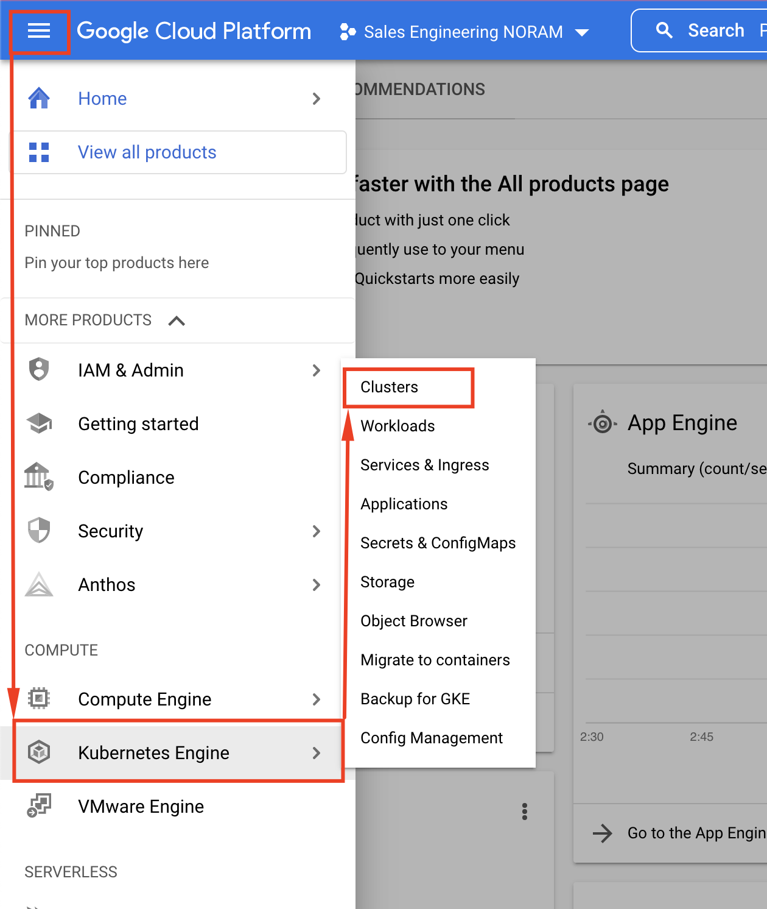
1. Click on "Create"
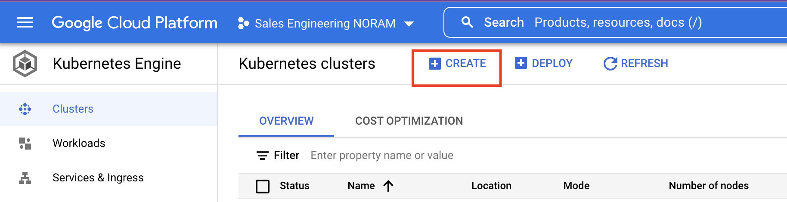
1. Select "GKE Standard"
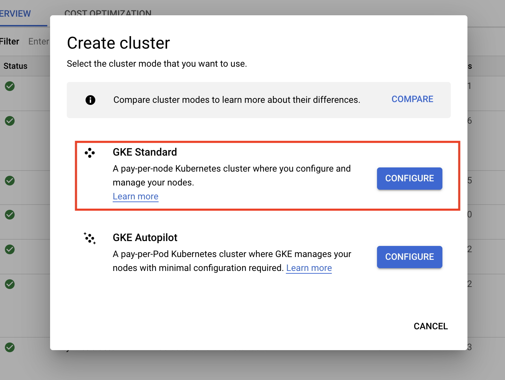
1. Optionally, Update the "name" and "zone" fields and click "Create"
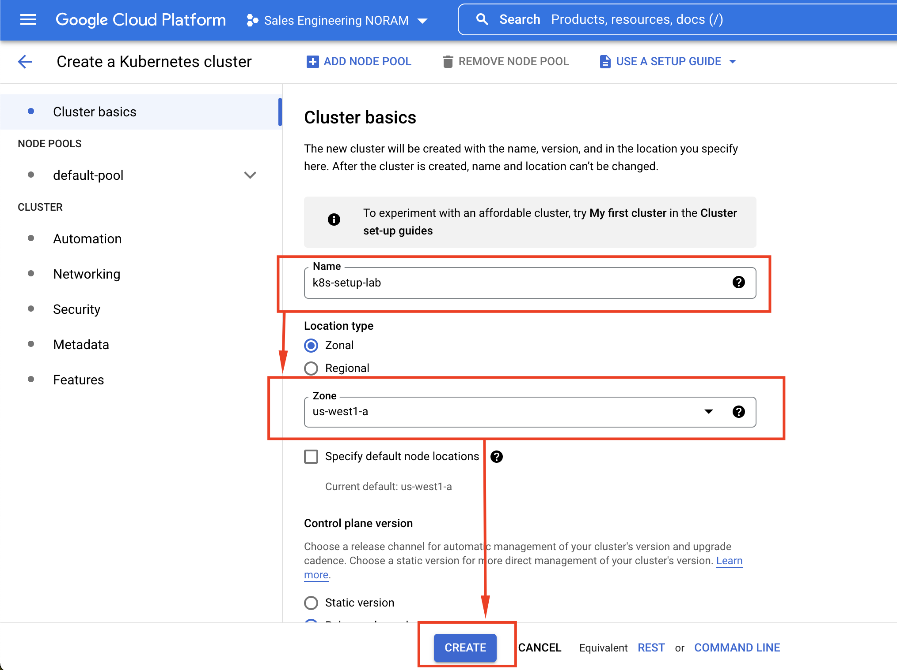

```Your Kubernetes cluster will now begin provisioning. This may take a few minutes to complete.```

<!-- -------------------------->
## SETUP: Connect to You k8s Engine Cluster
Duration: 15

### How to connect to you new kubernetes cluster
1. Once your cluster has successfully provisioned click on connect and select "_run  in cloud shell_"
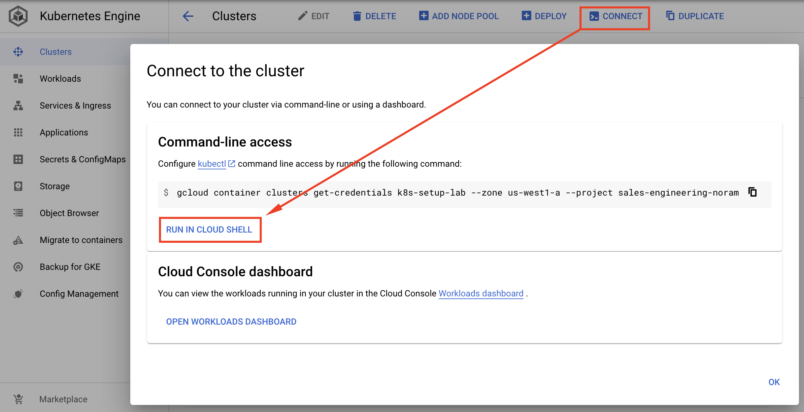
1. Once the cloud shell provisions it will populate a gcloud command for you to run. Press enter to run this command.

    `NOTE: YOU MUST RUN THIS COMMAND TO BE ABLE CONNECT TO THE K8S CLUSTER`
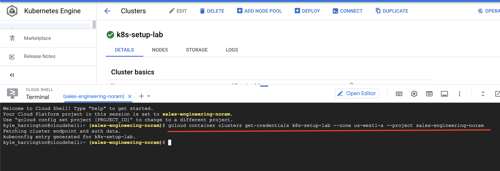
1. Once authenticated, run the command:
    > kubectl get nodes
1. This will return a list of the running kubernetes nodes in your cluster
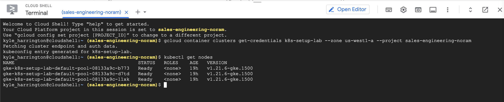

### Optional: Setup CLI Tools

If you would prefer to work with your cluster via an existing terminal setup, see below documentation for installing the gcloud and kubectl binaries to connect to your cluster.

#### Installing the gcloud cli
1. Navigate to [Installing the gcloud CLI Documentation](https://cloud.google.com/sdk/docs/install#linux)
1. Follow the installation instructions for your operating system:
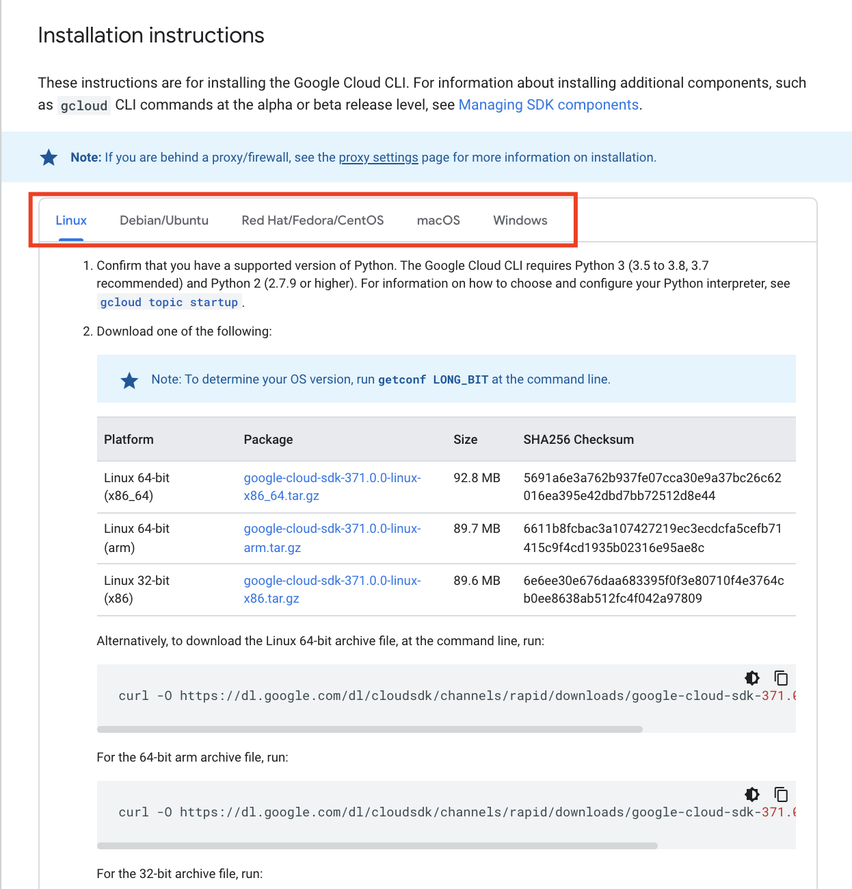

#### Installing kubectl cli
1. Navigate to [kubectl Installation Documentation](https://kubernetes.io/docs/tasks/tools/)
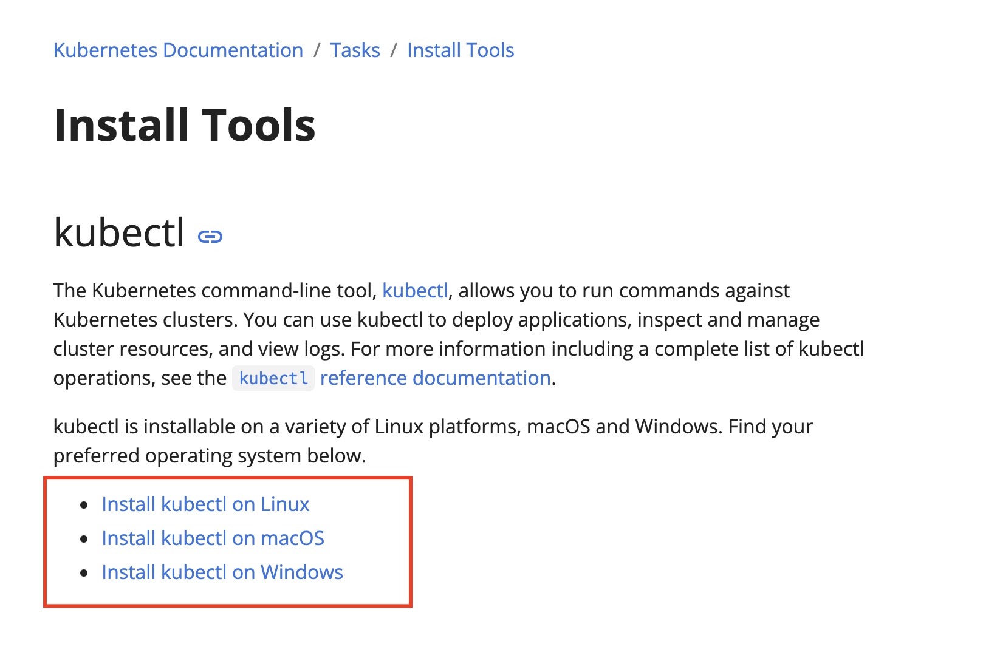


<!-- -------------------------->
## SETUP: Instrument You Kubernetes Cluster Dynatrace
Duration: 15

1. Now that your cluster is running, navigate to:

    _DYNATRACE HUB --> ONEAGENT --> DOWNLOAD ONEAGENT_

1. Select "_Kubernetes"_

1. Populate the name field, note that this must be unique to your environment
1. Click on "create tokens", this will generate new tokens for the operator deployment
1. Toggle on "skip ssl cert check"
1. Toggle on "Enable Volume Storage"
1. This will populate a command which you will run in your google cloud shell
1. Click on "copy"
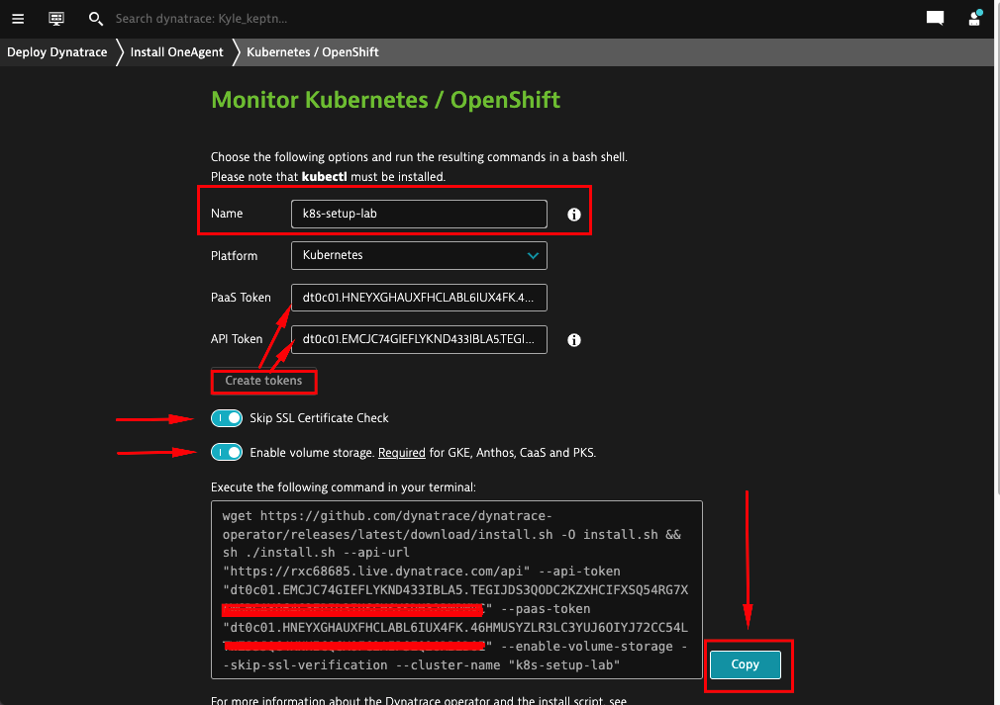
1. Then paste this command into the google cloud shell and run it:
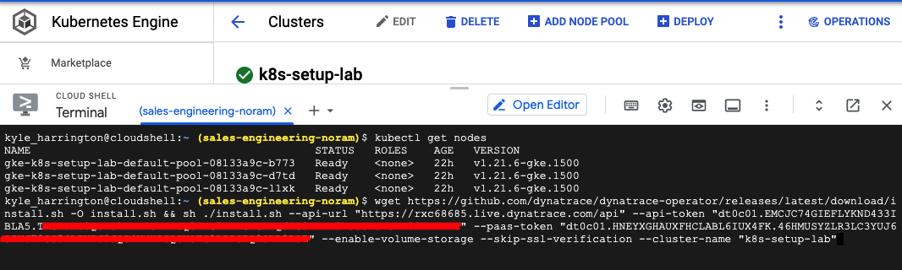
1. The below output will print when the operator has finished installing
    ```
    dynakube.dynatrace.com/dynakube created

    Adding cluster to Dynatrace...
    Kubernetes monitoring successfully setup.
    ```
1. Verify that all pods have been succefully deployed by running
    > kubectl get pods -n dynatrace

    which should out put something similar to below: 
    ```
    NAME                                 READY   STATUS    RESTARTS   AGE
    dynakube-activegate-0                1/1     Running   0          3m59s
    dynakube-oneagent-t86lr              1/1     Running   0          3m59s
    dynakube-oneagent-z7tmk              1/1     Running   0          3m59s
    dynakube-oneagent-zkv4j              1/1     Running   0          3m59s
    dynatrace-operator-f64554bb9-wv6wf   1/1     Running   0          4m34s
    dynatrace-webhook-c55cd7fc9-j4jnf    1/1     Running   0          4m34s
    ```
1. In your Dynatrace tenant, navigate to _INFRASTRUCTURE --> KUBERNETES_
Here you can your newly deployed cluster and any other k8s cluster you may have monitored with Dynatrace.
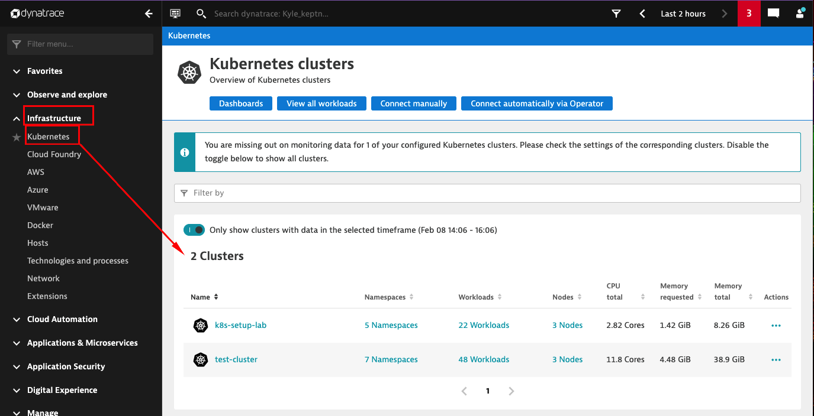
1. Click on "..." under "actions" and select "Settings" 

1. Scroll to the bottom of the page and toggle on both
    - "Monitor Events"
    - "Opt in to the Kubernetes events integration for analysis and alerting"
1. Click on "Save Changes"
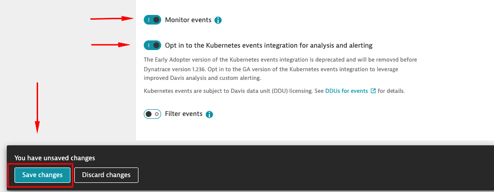

<!-- ------------------------ -->=
## LAB: The Kubernetes API Integration 
Duration: 5 

### Lets review the data Dynatrace has collected already:
Out of the box, Dynatrace automatically collects telemetry for
- Cluster utilization metrics
    - CPU & Memory Usage, Request and Limits
- Kubernetes Workload Metrics Aggregated by
    - Workload Type
    - Pods
    - Namespaces
- Kubernetes Vulnerabilities  

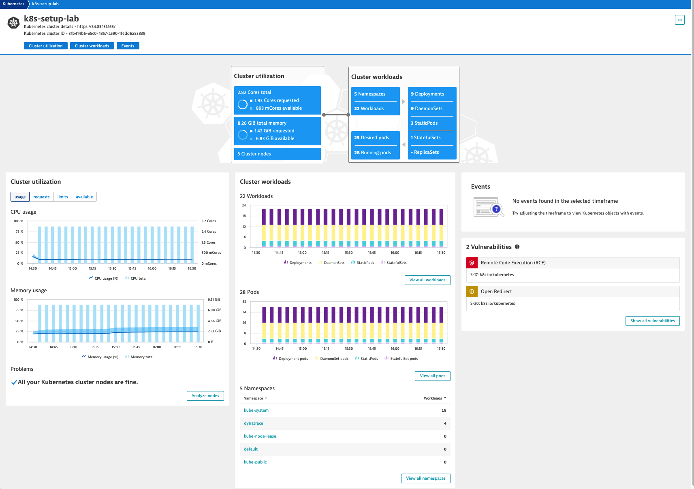

- Lets also note what is missing, Kubernetes events. We configured Dynatrace to capture all events in this cluster in our last step. We will now create a new application deployment which will populate Kubernetes native events in our dashboard
<!-- -------------------------->

## LAB: Deploying the Google Micro Services Application 


<!-- -------------------------->
## Wrap Up
Duration: 5
### What You Learned Today 
Review all the points you made at the start:
- What did you just learn?
- Why is this gained knowledge important?
- How will this knowledge now benefit your audience?
- What problem have we solved?
- Q&A 

<!-- ------------------------ -->
### Supplemental Material
Duration: 1


- [Markdown Formatting Refernce](https://github.com/adam-p/markdown-here/wiki/Markdown-Cheatsheet)
- [Codelab Formatting Guide](https://github.com/googlecodelabs/tools/blob/master/FORMAT-GUIDE.md)


`have a great time`

