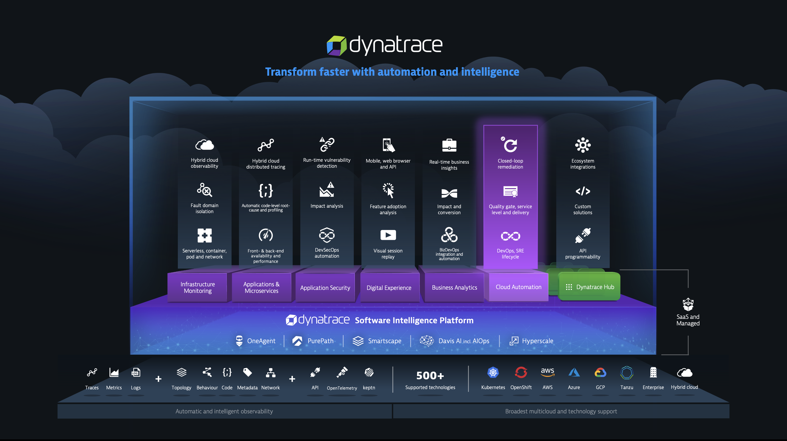

id: kubernetes-setup
summary: Dynatrace K8s Operator Install & Walk Through
author: Kyle Harrington
last update: 2/7/22

# Dynatrace K8s Operator Install & Walk Through
<!-- ------------------------ -->
## Overview 
Duration: 5

### What You’ll Learn Today 
Today we will cover the installation and value provided by the [Dynatrace Kubernetes Operator deployment](https://github.com/Dynatrace/dynatrace-operator)

The Dynatrace operator is the k8s native way to gain full stack observability in your kubernetes and open shift environments. The Dynatrace operator provides continuous, automatic discovery & observability across your kubernetes workloads. Leveraging Dynatrace, organizations can start Day 2 operations Day 1 and inform their shift left initiatives. 



In today's lab we will:

1. Stand up an new kubernetes cluster
1. Deploy the Dynatrace Operator
1. Deploy a Microservice sample application
1. Configure Real User Monitoring for our sample application
1. Set up synthetic checks 
1. Review the full stack data collected by Dynatrace


<!-- -------------------------->
## Technical Specification 
Duration: 5

### Prerequisites:

|Requirement|Source|  
|---|---| 
| Dynatrace SasS Tenant| https://www.dynatrace.com/trial/ |
kubectl cli | https://kubernetes.io/docs/tasks/tools/install-kubectl-linux/ |
|Kubernetes Cluster| https://cloud.google.com|
|Google Microservice Demo| https://github.com/GoogleCloudPlatform/microservices-demo|
|Dynatrace Operator| https://github.com/Dynatrace/dynatrace-operator|
|Requirement|Source|  
---
### Technologies in use
- Multiple Node Cluster in Google Kubernetes Engine
- Dynatrace Operator
- Nginx 

Dynatrace Operator Functionality Visualized: 


<!-- -------------------------->
## Setup: Google Kubernetes Engine
Duration:15

### Spin up a cluster in Google Kubernetes Engine
1. Navigate to [The Google Cloud Console](https://console.cloud.google.com/)
1. Navigate to _Kubernetes Engine --> Clusters_


1. Click on "Create"

1. Select "GKE Standard"

1. Optionally, Update the "name" and "zone" fields and click "Create"


Your Kubernetes cluster will now begin provisioning. This may take a few minutes to complete. 

>$ copy paste commands are recommend


Inline code formatting references: 

```bash
s="bash syntax highlighting"
print $s
```

<!-- -------------------------->
## Setup: Setup CLI Tools
Duration:15

### Spin up a cluster in Google Kubernetes Engine
1. Navigate to [The Google Cloud Console](https://console.cloud.google.com/)
1. Navigate to _Kubernetes Engine --> Clusters_


>$ copy paste commands are recommend


Inline code formatting references: 

```bash
s="bash syntax highlighting"
print $s
```

<!-- ------------------------ -->
## Demo The New Functionality
Duration: 30

### Make the sausage
- execute the demo on how to solve the problem statement you posed
- This might just be more steps (?)


Lorem ipsum dolor sit amet, consectetur adipiscing elit, sed do eiusmod tempor incididunt ut labore et dolore magna aliqua. Ut enim ad minim veniam, quis nostrud exercitation ullamco laboris nisi ut aliquip ex ea commodo consequat. Duis aute irure dolor in reprehenderit in voluptate velit esse cillum dolore eu fugiat nulla pariatur. Excepteur sint occaecat cupidatat non proident, sunt in culpa qui officia deserunt mollit anim id est laborum.


<!-- -------------------------->
## Wrap Up
Duration: 5
### What You Learned Today 
Review all the points you made at the start:
- What did you just learn?
- Why is this gained knowledge important?
- How will this knowledge now benefit your audience?
- What problem have we solved?
- Q&A 

<!-- ------------------------ -->
### Supplemental Material
Duration: 1


- [Markdown Formatting Refernce](https://github.com/adam-p/markdown-here/wiki/Markdown-Cheatsheet)
- [Codelab Formatting Guide](https://github.com/googlecodelabs/tools/blob/master/FORMAT-GUIDE.md)


`have a great time`

