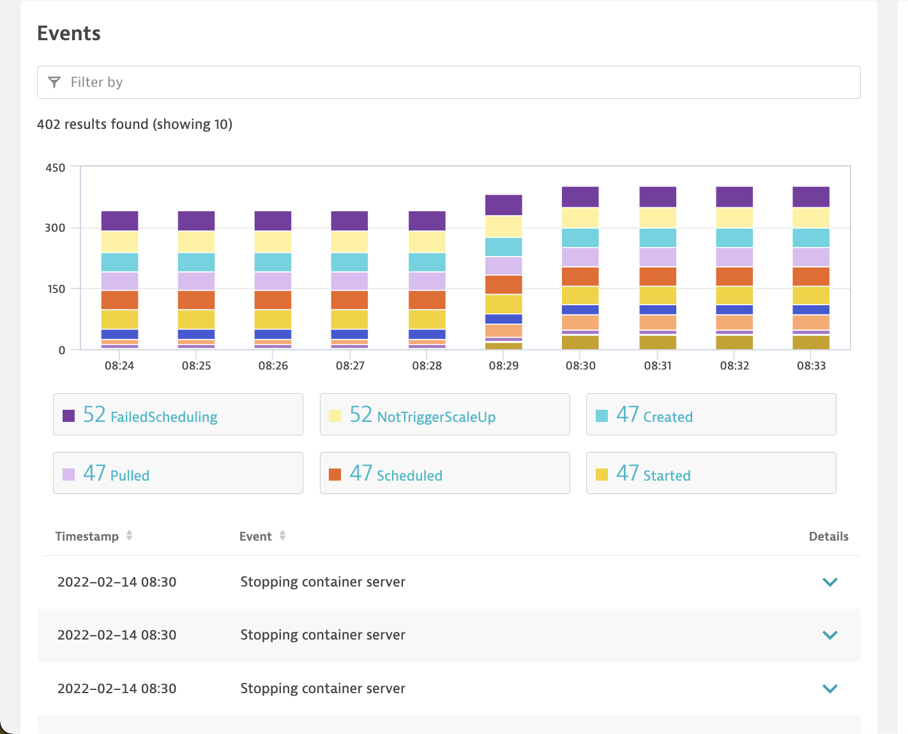

id: dt-kubernetes-setup
summary: Dynatrace K8s Operator Install & Walk Through
author: Kyle Harrington
last update: 2/14/22

# Dynatrace K8s Operator Install & Walk Through
<!-- ------------------------ -->
## Overview 
Duration: 5

### What You’ll Learn Today 
Today we will cover the installation and value provided by the [Dynatrace Kubernetes Operator deployment](https://github.com/Dynatrace/dynatrace-operator)

The Dynatrace operator is the k8s native way to gain full stack observability in your kubernetes and open shift environments. The Dynatrace operator provides continuous, automatic discovery & observability across your kubernetes workloads. Leveraging Dynatrace, organizations can start Day 2 operations Day 1 and inform their shift left initiatives. 


### In today's lab we will:

1. Stand up an new kubernetes cluster
1. Deploy the Dynatrace Operator
1. Deploy a Microservice sample application
1. Configure Real User Monitoring for our sample application
1. Set up synthetic checks 
1. Review the full stack data collected by Dynatrace


<!-- -------------------------->
## Technical Specification 
Duration: 5

### Technologies We Will Work With Today
- [Dynatrace SasS Tenant](https://www.dynatrace.com/trial/)
- [kubectl cli](https://kubernetes.io/docs/tasks/tools/install-kubectl-linux/)
- [Kubernetes](https://kubernetes.io/)
- [Google Kubernetes Engine](https://cloud.google.com)
- [Google Microservices Demo](https://github.com/GoogleCloudPlatform/microservices-demo)
- [Dynatrace Operator](https://github.com/Dynatrace/dynatrace-operator)

### Dynatrace Operator Functionality Visualized: 

The Dynatrace Operator deploys and maintains a DaemonSet across all workers nodes of your Kubernetes cluster. The Dynatrace Operator integrates with the Kubernetes API to provide native k8s events, monitors the cluster node health and provides code level visibility into all pods across all nodes _automatically_.


<!-- -------------------------->
## SETUP: Create a Google Kubernetes Engine Cluster
Duration: 5

### Spin up a cluster in Google Kubernetes Engine
1. Navigate to [The Google Cloud Console](https://console.cloud.google.com/)
1. Navigate to _Kubernetes Engine --> Clusters_

1. Click on "Create"

1. Select "GKE Standard"

1. Optionally, Update the "name" and "zone" fields and click "Create"


```Your Kubernetes cluster will now begin provisioning. This may take a few minutes to complete.```

<!-- -------------------------->
## SETUP: Connect to You k8s Engine Cluster
Duration: 15

### How to connect to you new kubernetes cluster
1. Once your cluster has successfully provisioned click on connect and select "_run  in cloud shell_"

1. Once the cloud shell provisions it will populate a gcloud command for you to run. Press enter to run this command.

    `NOTE: YOU MUST RUN THIS COMMAND TO BE ABLE CONNECT TO THE K8S CLUSTER`

1. Once authenticated, run the command:
    > kubectl get nodes
1. This will return a list of the running kubernetes nodes in your cluster


### Optional: Setup CLI Tools

If you would prefer to work with your cluster via an existing terminal setup, see below documentation for installing the gcloud and kubectl binaries to connect to your cluster.

#### Installing the gcloud cli
1. Navigate to [Installing the gcloud CLI Documentation](https://cloud.google.com/sdk/docs/install#linux)
1. Follow the installation instructions for your operating system:


#### Installing kubectl cli
1. Navigate to [kubectl Installation Documentation](https://kubernetes.io/docs/tasks/tools/)


<!-- -------------------------->
## SETUP: Instrument You Kubernetes Cluster Dynatrace
Duration: 15

1. Now that your cluster is running, navigate to:

    _DYNATRACE HUB --> ONEAGENT --> DOWNLOAD ONEAGENT_

1. Select "_Kubernetes"_

1. Populate the name field, note that this must be unique to your environment
1. Click on "create tokens", this will generate new tokens for the operator deployment
1. Toggle on "skip ssl cert check"
1. Toggle on "Enable Volume Storage"
1. This will populate a command which you will run in your google cloud shell
1. Click on "copy"

1. Then paste this command into the google cloud shell and run it:

1. The below output will print when the operator has finished installing
    ```
    dynakube.dynatrace.com/dynakube created

    Adding cluster to Dynatrace...
    Kubernetes monitoring successfully setup.
    ```
1. Verify that all pods have been succefully deployed by running
    > kubectl get pods -n dynatrace

    which should out put something similar to below: 
    ```
    NAME                                 READY   STATUS    RESTARTS   AGE
    dynakube-activegate-0                1/1     Running   0          3m59s
    dynakube-oneagent-t86lr              1/1     Running   0          3m59s
    dynakube-oneagent-z7tmk              1/1     Running   0          3m59s
    dynakube-oneagent-zkv4j              1/1     Running   0          3m59s
    dynatrace-operator-f64554bb9-wv6wf   1/1     Running   0          4m34s
    dynatrace-webhook-c55cd7fc9-j4jnf    1/1     Running   0          4m34s
    ```
1. In your Dynatrace tenant, navigate to _INFRASTRUCTURE --> KUBERNETES_
Here you can your newly deployed cluster and any other k8s cluster you may have monitored with Dynatrace.

1. Click on "..." under "actions" and select "Settings" 

1. Scroll to the bottom of the page and toggle on both
    - "Monitor Events"
    - "Opt in to the Kubernetes events integration for analysis and alerting"
1. Click on "Save Changes"


<!-- ------------------------ -->=
## LAB: The Kubernetes API Integration 
Duration: 5 

### Lets review the data Dynatrace has collected already:
Out of the box, Dynatrace automatically collects telemetry for
- Cluster utilization metrics
    - CPU & Memory Usage, Request and Limits
- Kubernetes Workload Metrics Aggregated by
    - Workload Type
    - Pods
    - Namespaces
- Kubernetes Vulnerabilities(!?)


- Lets also note what is missing, Kubernetes events. We configured Dynatrace to capture all events in this cluster in our last step. We will now create a new application deployment which will populate Kubernetes native events in our dashboard
<!-- -------------------------->

## LAB: Deploying the Google Micro Services Application 
Duration: 10 

Now we will deploy our sample application. We will use the Google Microservices demo application "Online boutique", this version has been branched from the [original] (https://github.com/GoogleCloudPlatform/microservices-demo)
> `NEED TO UPDATE REPO WITH HARRINGTON NGINX CONFIG INSTALLER`

1. Run 
    >kubectl apply -f release/kubernetes-manifests.yaml
1. Wait for the resources to become ready in your cluster
1. Verify all pods are running
    >kubectl get pods

1. Once all  your pods are running we'll want to access the web application. Run 
1. >  kubectl get service nginx
    ```
    NAME    TYPE           CLUSTER-IP    EXTERNAL-IP    PORT(S)        AGE
    nginx   LoadBalancer   10.96.1.110   34.82.179.37   80:30457/TCP   54m
    ```
1. Copy the EXTERNAL-IP address and paste it into a browser:
    

<!-- -------------------------->

## LAB: Creating a custom application
Duration: 15

Now that your application is running we will setup a custom application to review real user traffic
1. Navigate to _settings --> web and mobile monitoring -->  application dectection
1. click on "Add Detection Rule" 
    
1. Add a new rule with the following:
    - new application
    - name: "micro services demo"
    - define the rule as:  "if the url" "contains"
    - paste the url of the front end service
    - Click "Save"
    
    
    - 
1. Now that the application has been configured, navigate back your browser and lets explore the online boutique app. Dynatrace has already instrumented the web and infrastructure layer all we need now is some traffic! Take a minute to send some traffic to the application frontend.

<!-- -------------------------->

## LAB: Exploring The Telemetry Collected by Dynatrace
Duration: 15

While we configured the front end of the application, the OneAgent daemonset we deployed earlier has been collecting our newly deployed application's telemetry data. 

1. In your Dynatrace tenant, navigate to _INFRASTRUCTURE --> KUBERNETES_
1. If we scroll down to the events section, we'll see that this now populating k8s native events from the google microservices deployment:
    - Image pulls
    - New scheduling events
    - Pod starts

    

Further, if any issues like image pull back offs or OOM errors were taking place, Dynatrace will automatically populate that information in this screen. Next lets review how we can review the telemetry data which is being collected by Dynatrace. 

1. Navigate to _applications & microservices --> front end --> Microservices Demo_ 
    
1. From this view we can see all of the webfront end interactions which dyantrace is instrumenting out of the box:
    - End user load actions
    -Enduser interactions with the front end website
    - apdex
All of these are being instrumented out of the box with dynatrace full stack observability 

1. Next lets click on _"service" --> "view service flow"_
1. This view shows how both our traffic and the synthetic checks are generating traffic in our application.
1. The front end webserver is routing traffic through the nginx front end through all the microservices we've deployed:

    Dynatrace automatically instruments all transactions across all the containers we've deployed and any future deployments as well.


<!-- -------------------------->

## LAB: Kubernetes Scaling with Dynatrace
Duration: 15 

Now that we've seen how to dynatrace instruments an existing application lets see how dynatrace handles and instruments pods scaling. 

1. Back in the cloud console lets see how many pods are currently runnings
    > kubectl get pod
1. Your console should return similar to the below:

    > kubectl get deployments

1. Lets take a look a the deployments in the namespace, specifically the cart service

1. Lets scale the cart service up to 100 pods
    > kubectl scale deployment cartservice --replicas=100
1. This will begin spinning up new pods. You can see this by running:
    > kubectl get pod
    
1.  Navigate to _Kubernetes Engine --> Clusters --> Workloads_
      
1. From here we can immediately see that dynatrace has found an issue with trying to scale up the 100 pods we requested:
    - all pods have been grouped together under the cart service work load 
    - only 48 of the 100 we we requested we scheduleable 
    - Dynatrace has automatically created a problem beacuase of the resource contention
  
1. With this information, Dynatrace can be leveraged to proactively scale these nodes or descrease the pods scaling to resolve the resouce contention.
 
1. Lets scale the pods back down 
    > kubectl scale deployment cartservice --replicas=10
1. From the workload level we can see the scaling events taking place:
     
1. Once the pods stabilize dynatrace will automatically close this problem:
    


<!-- -------------------------->
## Wrap Up
Duration: 5
### Lab recap
Today we reviewed how the dynatrace platform can be leveraged to provide full stack observability across your kubernetes environments. To you learned how to

1. Stand up up an new kubernetes cluster
1. Deploy the Dynatrace Operator
1. Deploy a Microservice sample application
1. Configure Real User Monitoring for our sample application
1. Set up synthetic checks 

<!-- ------------------------ -->
### Supplemental Material
Duration: 1


- [Markdown Formatting Refernce](https://github.com/adam-p/markdown-here/wiki/Markdown-Cheatsheet)
- [Codelab Formatting Guide](https://github.com/googlecodelabs/tools/blob/master/FORMAT-GUIDE.md)
